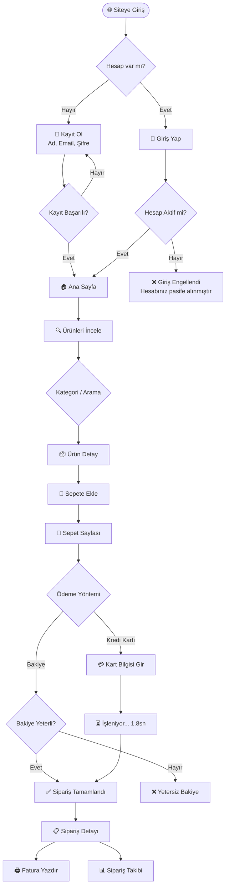
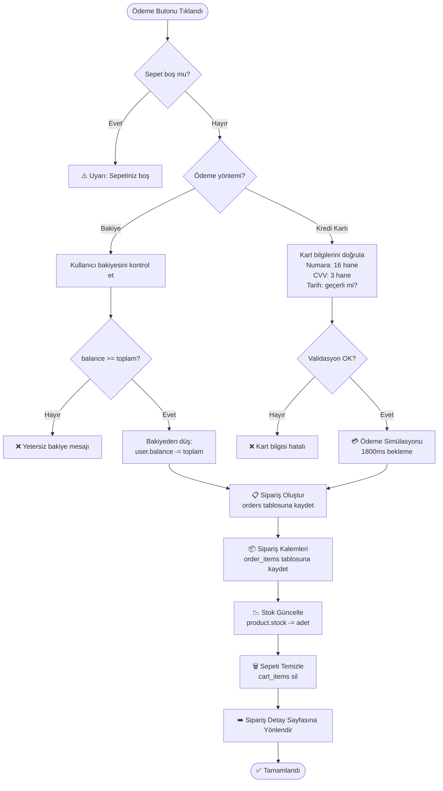
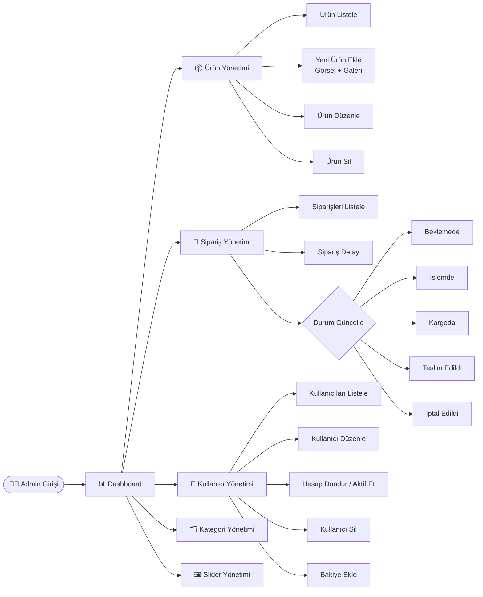

# 🔧 Garage360 — Online Oto Yedek Parça Mağazası

> KOÜ TBL304 Web Programlama Dersi Dönem Projesi  
> Geliştirici: Efe Aydın

---

## 📋 İçindekiler

- [Proje Hakkında](#proje-hakkında)
- [Özellikler](#özellikler)
- [Teknoloji Yığını](#teknoloji-yığını)
- [Sistem Mimarisi](#sistem-mimarisi)
- [Veritabanı Şeması](#veritabanı-şeması)
- [Kullanıcı Akış Diyagramı](#kullanıcı-akış-diyagramı)
- [Sipariş Algoritması](#sipariş-algoritması)
- [Admin Panel Akışı](#admin-panel-akışı)
- [Kurulum](#kurulum)
- [Proje Gereksinimleri Karşılama](#proje-gereksinimleri-karşılama)

---

## 🚗 Proje Hakkında

**Garage360**, Laravel 11 ile geliştirilmiş tam özellikli bir otomotiv yedek parça e-ticaret platformudur. Kullanıcılar ürünleri kategoriye göre filtreleyip sepete ekleyebilir, simüle kredi kartı ile ödeme yapabilir ve siparişlerini takip edebilir. Admin kullanıcılar ise ürün, kategori, slider, kullanıcı ve sipariş yönetimini tam olarak kontrol edebilir.

---

## ✅ Özellikler

### Kullanıcı Tarafı
- Kayıt / Giriş / Çıkış (Laravel Breeze)
- Profil düzenleme (ad, e-posta, telefon, adres, şehir)
- Hesabı pasife alma (kendi isteğiyle)
- Bakiye sistemi (admin tarafından yükleme)
- Ürün listeleme, kategori filtreleme, arama
- Ürün detay sayfası (fotoğraf galerisi, OEM numarası, araç uyumu)
- Sepete ekleme / miktar güncelleme / ürün silme
- Kredi kartı simülasyonu ile ödeme (Visa/Mastercard tespiti)
- Sipariş geçmişi ve sipariş detayı
- Fatura yazdırma (tarayıcı print API)
- Sipariş durumu takibi

### Admin Paneli
- Dashboard (toplam ürün, sipariş, kullanıcı, gelir istatistikleri)
- Ürün yönetimi (CRUD + çoklu görsel galerisi + para birimi seçimi)
- Kategori yönetimi (hiyerarşik, ebeveyn/alt)
- Slider yönetimi (görsel, başlık, altyazı)
- Sipariş yönetimi (durum güncelleme: Beklemede → İşlemde → Kargoda → Teslim Edildi → İptal)
- Kullanıcı yönetimi (listeleme, düzenleme, dondurma/aktifleştirme, silme)
- Kullanıcıya bakiye ekleme

---

## 🛠️ Teknoloji Yığını

| Katman | Teknoloji |
|--------|-----------|
| Backend Framework | Laravel 11 |
| PHP Versiyonu | PHP 8.3 |
| Frontend | Blade Templates + Bootstrap 5 |
| İkonlar | Bootstrap Icons |
| Veritabanı | MySQL 8.0 |
| Cache / Queue | Redis |
| Auth | Laravel Breeze |
| Rol Yönetimi | Spatie Laravel Permission |
| Yerel Geliştirme | Laravel Sail (Docker) |
| Versiyon Kontrolü | Git + GitHub |
| Deployment | Railway |

---

## 🏗️ Sistem Mimarisi

```
┌─────────────────────────────────────────────────────────────┐
│                        KULLANICI                            │
│              (Tarayıcı — Chrome/Safari/Firefox)             │
└─────────────────────┬───────────────────────────────────────┘
                      │  HTTP/HTTPS İstek
                      ▼
┌─────────────────────────────────────────────────────────────┐
│                   LARAVEL ROUTER                            │
│              routes/web.php                                 │
│   ┌──────────────────┬──────────────────────────────────┐   │
│   │  /admin/* rotaları│  Genel rotalar                  │   │
│   │  (admin middleware)│ (auth / guest middleware)      │   │
│   └────────┬─────────┴───────────────┬──────────────────┘   │
└────────────┼─────────────────────────┼─────────────────────-┘
             ▼                         ▼
┌────────────────────┐    ┌────────────────────────────────────┐
│  Admin Controllers │    │      Kullanıcı Controllers         │
│  AdminProductCtrl  │    │  ProductController                 │
│  AdminOrderCtrl    │    │  CartController                    │
│  AdminUserCtrl     │    │  OrderController                   │
│  AdminCategoryCtrl │    │  ProfileController                 │
│  AdminSliderCtrl   │    │  Auth/* Controllers                │
└────────┬───────────┘    └──────────────┬──────────────────-─-┘
         │                               │
         ▼                               ▼
┌─────────────────────────────────────────────────────────────┐
│                      ELOQUENT ORM                           │
│   Models: User, Product, Category, Order, OrderItem,        │
│           Slider, Cart, CartItem                            │
└─────────────────────────────┬───────────────────────────────┘
                              │
                              ▼
┌─────────────────────────────────────────────────────────────┐
│                      MySQL Veritabanı                       │
│   users │ products │ categories │ orders │ order_items      │
│   carts │ cart_items │ sliders │ roles │ permissions        │
└─────────────────────────────────────────────────────────────┘
```

---

## 🗄️ Veritabanı Şeması

```
USERS                          PRODUCTS
──────────────────             ──────────────────────────
id (PK)                        id (PK)
name                           name
email (unique)                 slug (unique)
password                       sku (unique)
phone                          brand
address                        oem_number
city                           category_id (FK → categories)
balance                        price
is_active                      sale_price
created_at                     currency (TRY/EUR)
updated_at                     stock
                               condition
                               short_description
CATEGORIES                     description
──────────────────             image
id (PK)                        gallery (JSON)
name                           vehicle_make
slug (unique)                  is_active
parent_id (FK → self)          is_featured
description                    created_at
created_at                     updated_at
updated_at

ORDERS                         ORDER_ITEMS
──────────────────             ──────────────────
id (PK)                        id (PK)
user_id (FK → users)           order_id (FK → orders)
total_price                    product_id (FK → products)
status                         quantity
payment_method                 unit_price
shipping_address               subtotal
billing_name
billing_phone
created_at
updated_at

SLIDERS
──────────────────
id (PK)
image
title (nullable)
subtitle (nullable)
button_text
button_url
order
is_active
```

---

## 👤 Kullanıcı Akış Diyagramı



---

## 🔄 Sipariş Algoritması



---

## ⚙️ Admin Panel Akışı



---

## 🚀 Kurulum

### Gereksinimler
- Docker Desktop
- Git

### Adımlar

```bash
# 1. Repoyu klonla
git clone https://github.com/efeilegames/carpartsonlineshopping.git
cd carpartsonlineshopping/garage360

# 2. Bağımlılıkları yükle (Docker üzerinden)
docker run --rm -v $(pwd):/opt -w /opt laravelsail/php83-composer:latest composer install

# 3. Ortam dosyasını oluştur
cp .env.example .env

# 4. Sail ile başlat
./vendor/bin/sail up -d

# 5. Uygulama anahtarı oluştur
./vendor/bin/sail artisan key:generate

# 6. Veritabanını hazırla
./vendor/bin/sail artisan migrate --seed

# 7. Storage sembolik linki oluştur
./vendor/bin/sail artisan storage:link
```

### Varsayılan Kullanıcılar

| Rol | E-posta | Şifre |
|-----|---------|-------|
| Admin | admin@garage360.com | password |
| Kullanıcı | user@garage360.com | password |

Uygulama `http://localhost` adresinde çalışır.

---

## 📁 Proje Yapısı

```
garage360/
├── app/
│   ├── Http/
│   │   ├── Controllers/
│   │   │   ├── Admin/          # Admin panel controller'ları
│   │   │   └── ...             # Kullanıcı controller'ları
│   │   └── Requests/           # Form doğrulama kuralları
│   └── Models/                 # Eloquent modelleri
├── database/
│   ├── migrations/             # Veritabanı şema değişiklikleri
│   └── seeders/                # Örnek veri doldurucular
├── resources/
│   └── views/
│       ├── admin/              # Admin panel Blade şablonları
│       ├── auth/               # Giriş/kayıt sayfaları
│       ├── cart/               # Sepet sayfası
│       ├── orders/             # Sipariş sayfaları
│       ├── products/           # Ürün sayfaları
│       └── profile/            # Profil sayfası
├── routes/
│   └── web.php                 # Tüm uygulama rotaları
└── storage/
    └── app/public/             # Yüklenen görseller
```

---

## 📊 Proje Gereksinimleri Karşılama

| # | Gereksinim | Durum |
|---|-----------|-------|
| 1 | Kullanıcı kayıt / giriş / çıkış | ✅ |
| 2 | Admin / Kullanıcı rol ayrımı | ✅ |
| 3 | Ürün listeleme ve filtreleme | ✅ |
| 4 | Ürün detay sayfası | ✅ |
| 5 | Sepet sistemi | ✅ |
| 6 | Kredi kartı ödeme simülasyonu | ✅ |
| 7 | Bakiye ile ödeme | ✅ |
| 8 | Sipariş oluşturma ve takibi | ✅ |
| 9 | Fatura yazdırma | ✅ |
| 10 | Admin ürün yönetimi (CRUD) | ✅ |
| 11 | Çoklu ürün görseli (galeri) | ✅ |
| 12 | Admin sipariş durum yönetimi | ✅ |
| 13 | Admin kullanıcı yönetimi | ✅ |
| 14 | Kullanıcı dondurma / aktifleştirme | ✅ |
| 15 | Kullanıcıya bakiye ekleme | ✅ |
| 16 | Profil güncelleme | ✅ |
| 17 | Hesabı pasife alma | ✅ |
| 18 | Kategori hiyerarşisi | ✅ |
| 19 | Slider yönetimi | ✅ |
| 20 | Responsive tasarım | ✅ |

---

## 👨‍💻 Geliştirici

**Efe Aydın**  
Kocaeli Üniversitesi — Bilgisayar Mühendisliği  
TBL304 Web Programlama — 2025/2026 Bahar Dönemi

---

*Bu proje eğitim amaçlı geliştirilmiştir.*
